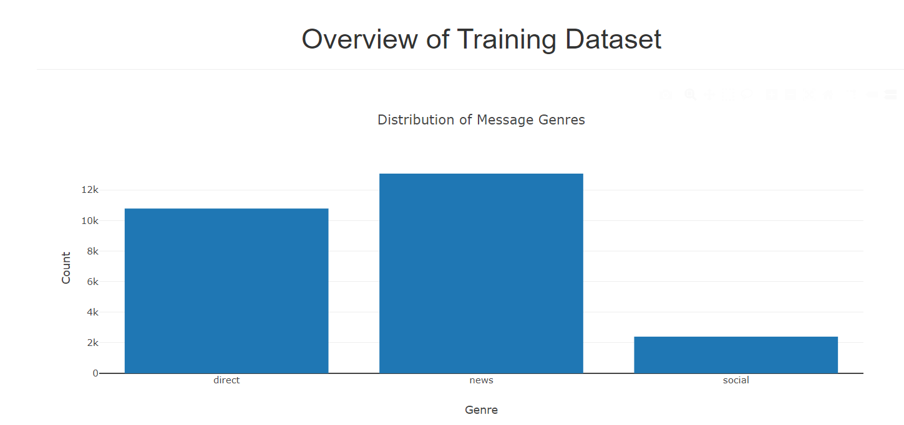
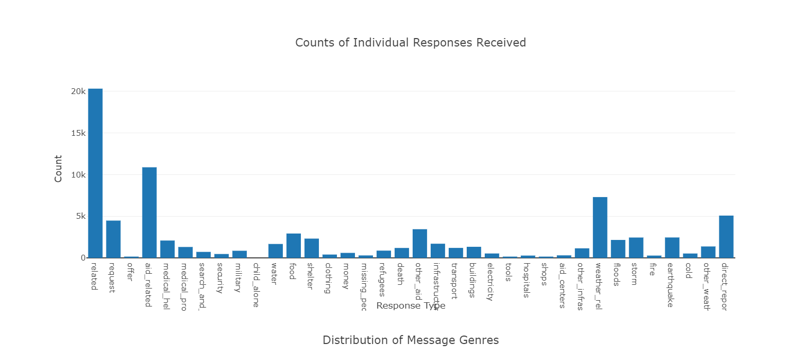
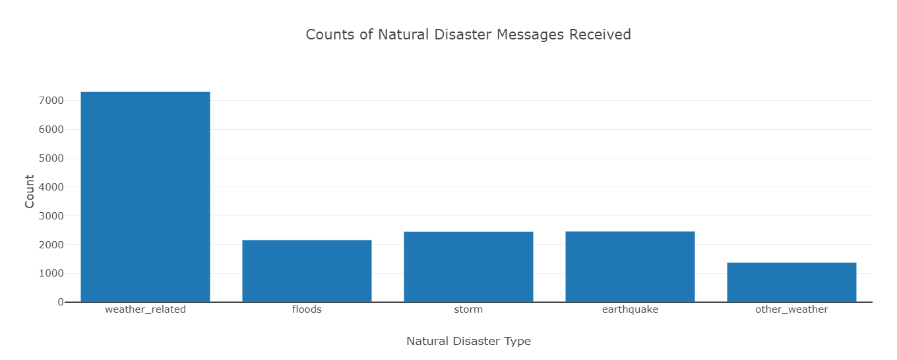
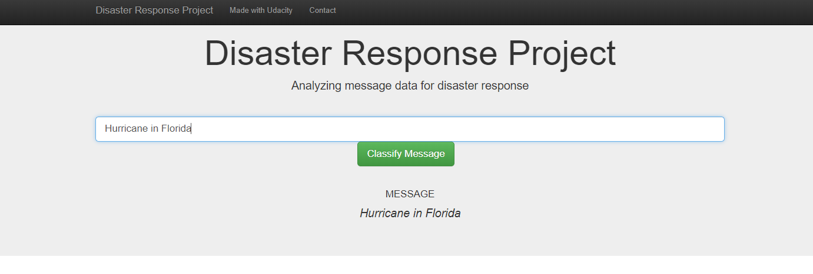
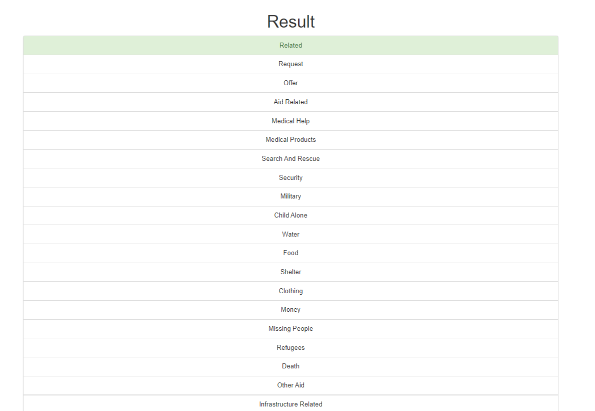
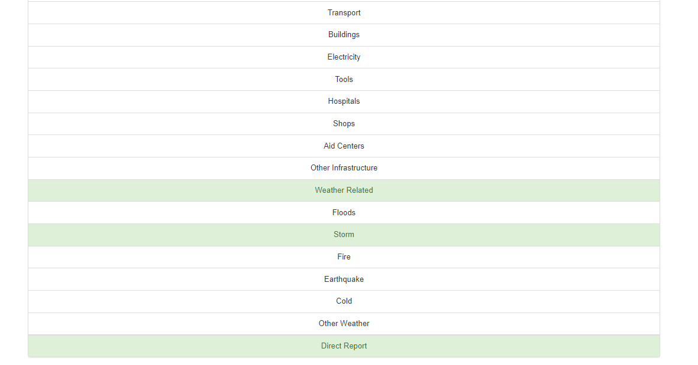

## Welcome to Disaster Response Pipeline Project

In this project we will create a Scikit-Learn Pipeline with a Random Forest classifier and try to classify newly received text message into available disaster message categories. 

The project focuses on the following steps:

1. Data Cleaning

	a. Extract      - Extracting the csv data into pandas dataframe to further clean and analyze.

	b. Transform    - Convert columns into a shape we could use to analyze. This will involve merging or splitting of columns,		removal of duplicate rows and other data transformations required to reshape the data.

	c. Load         - Load the transformed data as a database table to the specified SQLite database.
	
2. Model Building   - Build the Random Forest model on the training dataset, tune hyper parameters using GridSearchCSV and save the optimal model.

3. Model Evaluation - Score the model on test data and obtain F1-Scores to compare the model quality.

4. Model Deployment - Deploy the Python pickle model to a web application built with Flask and classify text messages received in real-time.

### Table of Contents

1. [Installation](#installation)
2. [Instructions](#instructions)
2. [Motivation](#motivation)
3. [File Descriptions](#files)
4. [Summary Results](#summaryresults)
5. [Licensing, Authors, and Acknowledgements](#licensing)

## Installation 

The python files in this repo should run on an machine with Anaconda distribution of Python versions 3.*.

To explore this project please download the following folders,

1. The **data** folder with the datasets (disaster_categories.csv & disaster_messages.csv) and process_data.py

2. The **models** folder with train_classifier.py

3. The **app** folder with run.py to initialize and run a Flask based web application.

### Instructions 

1. Run the following commands in the project's root directory to set up your database and model.

    - To run ETL pipeline that cleans data and stores in database
        `python data/process_data.py data/disaster_messages.csv data/disaster_categories.csv data/DisasterResponse.db`
		
    - To run ML pipeline that trains classifier and saves
        `python models/train_classifier.py data/DisasterResponse.db models/classifier.pkl`

2. Run the following command in the app's directory to run your web app.
    `python run.py`

3. Go to http://0.0.0.0:3001/

## Motivation

This project provides a deeper insight into the routine tasks of a Data Scientist. The project provides a hands on experience for software developers who would like to learn Data Scientist skills and actionize it.
    
## File Descriptions 

There are several files in this repo, the important ones and their descriptions are below:

1. **disaster_messages.csv** - This is the messages table for training the model pipeline
				
2. **disaster_categories.csv** - This is the categories table for training the model pipeline.

3. **process_data.py** - Python module that performs Extract, Transform and Load (ETL) on the csv files and loads the SQLite data table "UniqueMessages" for modeling and analysis.

4. **train_classifier.py** - Python module to Create, Build, Evaluate and Save a Python model for scoring in real-time using the WebApp.

5. **DisasterResponse.db** - The stored SQLite database file with the stored "UniqueMessages" table generated by running process_data.py

6. **classifier.pkl** - The Python pickle model file that can be deployed using a Flask based web application.

7. **run.py** - The web application model deployment module that hosts a Flask(a lightweight WSGI web application framework) based WebPage at http://0.0.0.0:3001/ after invocation.
			   
## Summary Results

In this project we built a multiple response classifier using the Random Forest classification model. The model performed fairly well on the test dataset and provided the following F1-Scores, precison, accuracy and recall on the test dataset. There were in total 36 classes we predicted, the results from classification report summary for the  first 3 categories are below. 

Here are some of the screenshots of the web application showing, 

1. **The overview of the training dataset**

2. **Test the real time Query - Hurricane in Florida**

3. **Classifier Response**

## Licensing, Author

The datasets and html templates were provided as part of Data Scientist Nano Degree program https://www.udacity.com/course/data-scientist-nanodegree--nd025

I am the author of the python code in this repo. Feel free to use or modify the attached python code. Have fun and enjoy coding Data Science!
